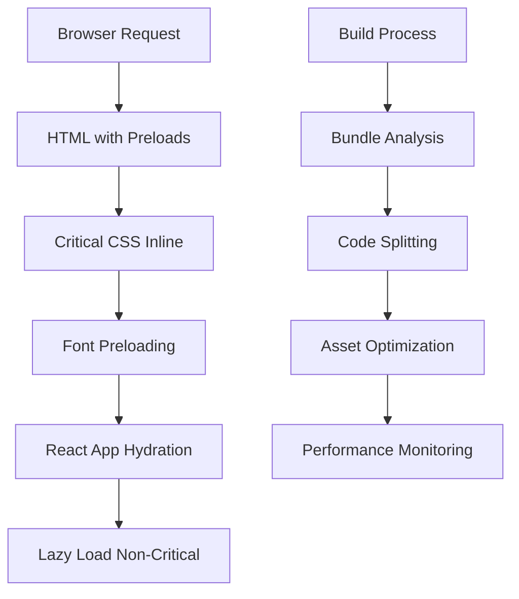

# LCP Optimization Design Document

## Overview

This design outlines a comprehensive approach to optimize the Largest Contentful Paint (LCP) for the PikmiCards React application. The optimization strategy focuses on four key areas: font loading optimization, CSS and JavaScript bundle optimization, image optimization, and performance monitoring. The solution will implement modern web performance best practices while maintaining the existing functionality and user experience.

## Architecture

### Performance Optimization Pipeline



### Resource Loading Strategy

1. **Critical Path Optimization**: Prioritize resources needed for above-the-fold content
2. **Progressive Enhancement**: Load non-critical resources after initial render
3. **Caching Strategy**: Implement efficient caching for static assets
4. **Monitoring Integration**: Continuous performance tracking and alerting

## Components and Interfaces

### 1. Font Loading Optimization

**Component**: FontPreloader
- **Purpose**: Manage efficient font loading without render blocking
- **Implementation**: 
  - Preload critical fonts in HTML head
  - Use font-display: swap for graceful fallbacks
  - Implement font loading API for better control

**Interface**:
```typescript
interface FontConfig {
  family: string;
  weights: number[];
  display: 'swap' | 'fallback' | 'optional';
  preload: boolean;
}

interface FontPreloader {
  preloadFonts(fonts: FontConfig[]): void;
  getFontLoadPromise(family: string): Promise<void>;
}
```

### 2. CSS Optimization

**Component**: CriticalCSSExtractor
- **Purpose**: Identify and inline critical CSS for above-the-fold content
- **Implementation**:
  - Extract critical CSS during build
  - Inline critical styles in HTML head
  - Defer non-critical CSS loading

**Interface**:
```typescript
interface CSSOptimizer {
  extractCriticalCSS(html: string): string;
  deferNonCriticalCSS(cssFiles: string[]): void;
  inlineCriticalCSS(criticalCSS: string): void;
}
```

### 3. Bundle Optimization

**Component**: BundleOptimizer
- **Purpose**: Implement code splitting and optimize JavaScript bundles
- **Implementation**:
  - Route-based code splitting
  - Dynamic imports for non-critical features
  - Tree shaking for unused code elimination

**Interface**:
```typescript
interface BundleConfig {
  chunkSizeLimit: number;
  splitChunks: {
    vendor: boolean;
    common: boolean;
  };
  dynamicImports: string[];
}

interface BundleOptimizer {
  configureSplitting(config: BundleConfig): void;
  analyzeBundleSize(): BundleAnalysis;
}
```

### 4. Image Optimization

**Component**: ImageOptimizer
- **Purpose**: Optimize images for faster loading and better LCP
- **Implementation**:
  - Preload LCP images
  - Implement responsive images
  - Use modern image formats

**Interface**:
```typescript
interface ImageConfig {
  src: string;
  alt: string;
  priority: 'high' | 'low';
  lazy: boolean;
  formats: ('webp' | 'avif' | 'jpeg')[];
}

interface ImageOptimizer {
  optimizeImage(config: ImageConfig): OptimizedImage;
  preloadLCPImages(images: string[]): void;
}
```

### 5. Performance Monitor

**Component**: LCPMonitor
- **Purpose**: Track and report LCP performance metrics
- **Implementation**:
  - Web Vitals API integration
  - Performance observer for LCP measurement
  - Reporting to analytics

**Interface**:
```typescript
interface PerformanceMetrics {
  lcp: number;
  fid: number;
  cls: number;
  ttfb: number;
}

interface LCPMonitor {
  measureLCP(): Promise<number>;
  reportMetrics(metrics: PerformanceMetrics): void;
  setLCPThreshold(threshold: number): void;
}
```

## Data Models

### Performance Configuration

```typescript
interface PerformanceConfig {
  lcp: {
    desktopThreshold: number; // 2.5s
    mobileThreshold: number;  // 4.0s
    monitoringEnabled: boolean;
  };
  fonts: FontConfig[];
  images: {
    lcpCandidates: string[];
    lazyLoadThreshold: string;
  };
  bundles: BundleConfig;
}
```

### Performance Report

```typescript
interface PerformanceReport {
  timestamp: Date;
  url: string;
  metrics: PerformanceMetrics;
  deviceType: 'desktop' | 'mobile';
  connectionType: string;
  lcpElement: {
    tagName: string;
    id?: string;
    className?: string;
    src?: string;
  };
}
```

## Error Handling

### Font Loading Failures
- **Strategy**: Graceful degradation to system fonts
- **Implementation**: Font loading timeout with fallback
- **User Impact**: Minimal - content remains readable

### Bundle Loading Failures
- **Strategy**: Retry mechanism with exponential backoff
- **Implementation**: Service worker for offline capability
- **User Impact**: Loading states and error boundaries

### Image Loading Failures
- **Strategy**: Placeholder images and retry logic
- **Implementation**: Intersection observer for lazy loading
- **User Impact**: Progressive image loading with fallbacks

### Performance Monitoring Failures
- **Strategy**: Silent failure with local logging
- **Implementation**: Try-catch blocks around performance APIs
- **User Impact**: None - monitoring is transparent

## Testing Strategy

### Performance Testing
1. **Lighthouse CI**: Automated performance testing in CI/CD
2. **Real User Monitoring**: Track actual user performance
3. **Synthetic Testing**: Regular performance audits
4. **A/B Testing**: Compare optimization impact

### Unit Testing
- Font preloader functionality
- CSS extraction utilities
- Bundle analyzer functions
- Image optimization helpers

### Integration Testing
- End-to-end LCP measurement
- Performance regression testing
- Cross-browser compatibility
- Mobile performance validation

### Performance Benchmarks
- **Baseline Measurement**: Current LCP scores
- **Target Metrics**: 
  - Desktop LCP < 2.5s
  - Mobile LCP < 4.0s
  - Bundle size reduction > 20%
  - Font loading improvement > 30%

## Implementation Phases

### Phase 1: Foundation
- Set up performance monitoring
- Implement font preloading
- Basic bundle optimization

### Phase 2: Advanced Optimization
- Critical CSS extraction
- Image optimization
- Advanced code splitting

### Phase 3: Monitoring & Refinement
- Performance dashboard
- Automated alerts
- Continuous optimization